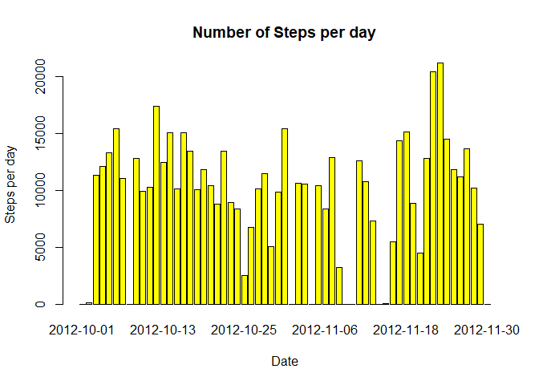
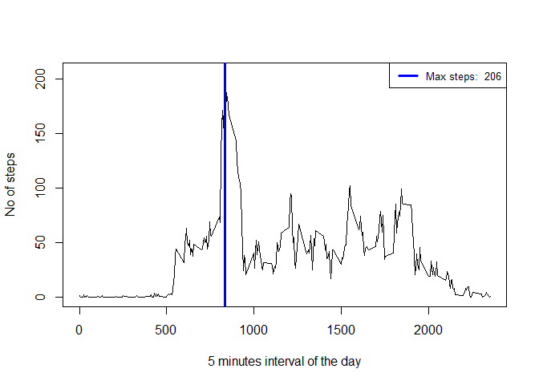

### Set up Global Environment

#### 1. loaded dplyr, sqldf, lattice, data.table libraries

#### 2. set echo = TRUE to display code in the HTML file

    knitr::opts_chunk$set(echo = TRUE)
    library(dplyr)

    ## 
    ## Attaching package: 'dplyr'

    ## The following objects are masked from 'package:stats':
    ## 
    ##     filter, lag

    ## The following objects are masked from 'package:base':
    ## 
    ##     intersect, setdiff, setequal, union

    library(sqldf)

    ## Loading required package: gsubfn

    ## Loading required package: proto

    ## Loading required package: RSQLite

    library(lattice)
    library(data.table)

    ## 
    ## Attaching package: 'data.table'

    ## The following objects are masked from 'package:dplyr':
    ## 
    ##     between, first, last

Read csv file activity.csv
--------------------------

### The variables included in this dataset are:

#### 1.steps: Number of steps taking in a 5-minute interval (missing values are coded as NA)

#### 2.date: The date on which the measurement was taken in YYYY-MM-DD format

#### 3.interval: Identifier for the 5-minute interval in which measurement was taken

    activity<-read.csv("activity.csv")

### Calculate steps per day and generating Histogram showing dates on x-axis and Steps per day on y-axis

    ##library(dplyr)
    ##library(data.table)
    activity_tab<-data.table(activity)
    steps.day<-activity_tab[, list(steps=sum(steps, na.rm = T)), by = date]
    mean_val<-steps.day %>% summarise(mean(steps))
    median_val <- steps.day %>% summarise(median(steps))
    hist(steps.day$steps, breaks = 60, xlab = "Steps per day", ylab = "Frequency", main = "Number of Steps per day", col = c("grey"))

    abline(v=mean_val, lwd = 3, col = 'blue')
    abline(v=median_val, lwd = 3, col = 'red')
    legend('topright', lty = 1, lwd = 3, col = c("blue", "red"), cex = .8, legend = c(paste('Mean: ', round(mean_val)), paste('Median:', median_val)))

    ##dev.copy(png, filename = "StepsPerDay.png", width = 480, height = 480, units = "px")
    ##dev.off()

#### Plotting a barplot to display Number of steps taken each day

    ##library(dplyr)
    steps.day %>% summarise(mean(steps), median(steps))

    ##   mean(steps) median(steps)
    ## 1     9354.23         10395

    plot<-barplot(height = steps.day$steps, names.arg = steps.day$date,  xlab = "Date", ylab = "Steps per day", col = "yellow", main = "Number of Steps per day")

    ##dev.copy(png, filename = "StepsPerDay_1.png", width = 480, height = 480, units = "px")
    ##dev.off()

Time series plot of the average number of steps taken
-----------------------------------------------------

#### 1.Make a time series plot (i.e. type = "l") of the 5-minute interval (x-axis) and the average number of steps taken, averaged across all days (y-axis)

#### 2.Which 5-minute interval, on average across all the days in the dataset, contains the maximum number of steps?

#### Blue vertical line is for interval with maximum number of steps

    steps.int<-aggregate(steps ~ interval, activity, mean)
     plot( steps.int$interval, steps.int$steps, type = "l", xlab = "5 minutes interval of the day", ylab = "No of steps")
     abline(v=steps.int[which.max(steps.int$steps),1], lwd = 3, col = 'blue')
     legend('topright', lty = 1, lwd = 3, col = c("blue", "red"), cex = .8, legend = c(paste('Max steps: ', round(steps.int[which.max(steps.int$steps), 2]))))

    ## dev.copy(png, filename = "AverageStepsPerInverval.png", width = 480, height = 480, units = "px")
    ##dev.off()
     print("Interval with maximum number of steps:  ")

    ## [1] "Interval with maximum number of steps:  "

     print(steps.int[which.max(steps.int$steps), ])

    ##     interval    steps
    ## 104      835 206.1698

### Findings of Time Series plot of average steps in 5 minutes interval

#### 1. Maximum number of avaerage steps per interval: 206 in interval 835

Code to describe and show a strategy for imputing missing data
--------------------------------------------------------------

### Removing NAs from activity dataframe and replacing with interval mean values

#### 1. Create subset of activity data. subset contains only rows with NA in steps field.

#### 2. Replace NA values with interval means

#### 3. create subset of activity data - subset contains only rows with NO NA in steps field

#### 4. merge 2 subsets.

#### 5. Verify:

##### a. Total number of records in merged database is equal to total number of rows in original activity dataframe

##### b. Mean and median calculations of merged data and original activity data

##### c. average steps perday of both merged and original data

##### d. average steps per interval

    ##library(dplyr)
    ##library(sqldf)
    actNA <- activity[is.na(activity$steps), ]
    stepsint <-steps.int
    actNA <-sqldf("select * from actNA inner join stepsint on actNA.interval = stepsint.interval ")
    actNA <-actNA[, c(5, 2, 3)]
    actNA$steps <- round(actNA$steps)
    act<-activity[!is.na(activity$steps),]
    active <-rbind(act, actNA)
    active_tab<-data.table(active)
    steps.na<-active_tab[, list(steps=sum(steps, na.rm = T)), by = date]
    mean_valna<-steps.na %>% summarise(mean(steps))
    median_valna <- steps.na %>% summarise(median(steps))

Histogram of the total number of steps taken each day after missing values are imputed
--------------------------------------------------------------------------------------

### Compare Histograms of total number of steps taken each day before and after missing values are imputed

    par(mfrow=c(2,1))
    hist(steps.day$steps, breaks = 60, xlab = "Steps per day", ylab = "Frequency", main = "Number of Steps per day before replacing NAs", col = c("grey"))
                                        
    abline(v=mean_val, lwd = 3, col = 'blue')
    abline(v=median_val, lwd = 3, col = 'red')
    legend('topright', lty = 1, lwd = 3, col = c("blue", "red"), cex = .8, legend = c(paste('Mean: ', round(mean_val)), paste('Median:', median_val)))

    hist(steps.na$steps, breaks = 60, xlab = "Steps per day", ylab = "Frequency", main = "Number of Steps per day after replacing NAs", col = c("grey"))
    abline(v=mean_valna, lwd = 3, col = 'blue')
    abline(v=median_valna, lwd = 3, col = 'red')
    legend('topright', lty = 1, lwd = 3, col = c("blue", "red"), cex = .8, legend = c(paste('Mean: ', round(mean_valna)), paste('Median:', median_valna)))

    ##dev.copy(png, filename = "CompareAverageStepsPerInverval.png", width = 480, height = 480, units = "px")
    ##dev.off()

### Findings of comparing between 'Before Replacing NA' and 'after Replacing NAs'

#### 1. Mean Value increased

#### 2. Median Value is not changed much

\_\_\_\_\_\_\_\_\_\_\_\_\_\_\_\_\_\_\_\_\_\_\_\_\_\_\_\_\_\_\_\_\_\_\_\_\_\_\_\_\_\_\_\_
----------------------------------------------------------------------------------------

Panel plot comparing the average number of steps taken per 5-minute interval across weekdays and weekends
---------------------------------------------------------------------------------------------------------

#### 1. Calculate Weekdays of the activity dates

#### 2. Replace Saturday and Sunday with "Weekend" and rest of the days with "Weekdays"

#### 3. Generate Panel plot comparing the average number of steps taken per 5-minute interval across weekdays and weekends

    ##library(lattice)
    active$day<-weekdays(as.Date(active$date,'%Y-%m-%d'))
    active$day<-replace(active$day, active$day %in% c("Monday", "Tuesday", "Wednesday", "Thursday", "Friday"), "Weekday")
    active$day<-replace(active$day, active$day %in% c("Saturday", "Sunday"), "Weekend")
    active.wkday<- aggregate(steps ~ interval + day, active, mean)
    xyplot(steps ~ interval | day, active.wkday, type = "l", layout = c(1, 2), xlab = "Interval", ylab = "Number of steps")

    ##dev.copy(png, filename = "AverageStepsPerInverval_Weekday_vs_weekend.png", width = 480, height = 480, units = "px")
    ##dev.off()

### Findings of comparing Weekday vs WeekEnd activity:

#### 1. During Weekend fewer number of steps per day

#### 2. Maximum number of steps during weekend is ~150 vs ~ 250 over Weekdays
